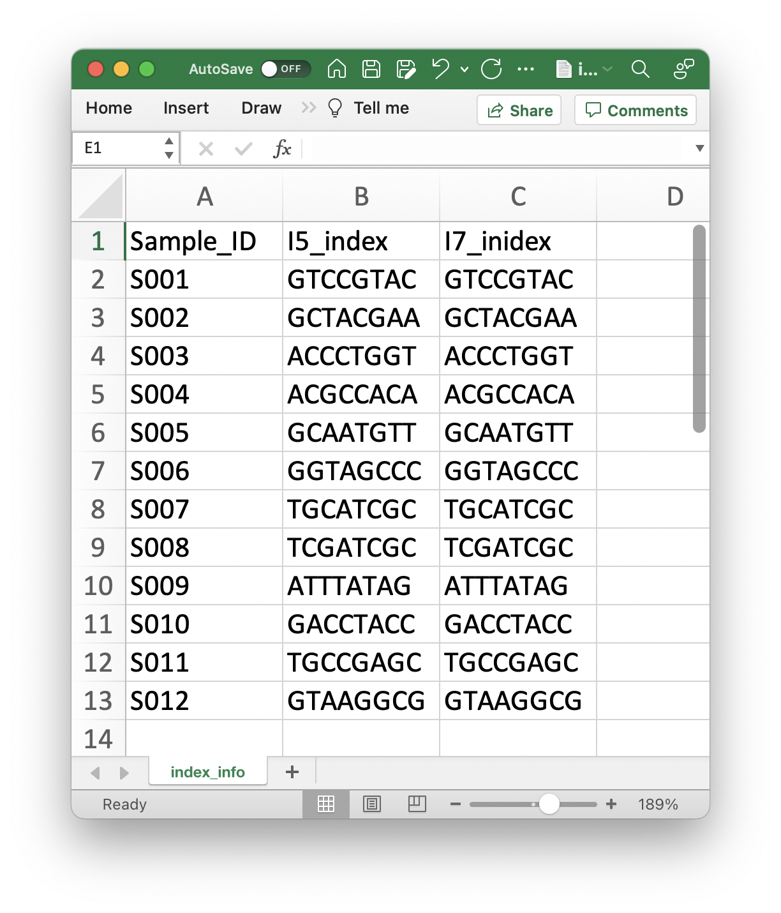

# Scripts to demultiplex FASTQ files generated by the early-pooling protocol
[](https://zenodo.org/badge/latestdoi/458201868)

This script helps demultiplexing FASTQ files generated by sequencing DNA libraries constructed by the early-pooling protocol described in Ushio et al. (to be submitted) _bioRxiv_.

## License
See LICENSE.

## Requirements
- seqkit (https://bioinf.shenwei.me/seqkit/)
- The script is for Linux and macOS. Not for Windows.

## Quick use
First, specify the sequence data folder (`SEQ_DIR`), forward read file (`SEQ_FILE_R1`), reverse read file (`SEQ_FILE_R2`), and sample data (`SAMPLE_DATA`).

```
# Set parameters
SEQ_DIR=seqdata
SEQ_FILE_R1=sample_fastq_R1.fastq.gz
SEQ_FILE_R2=sample_fastq_R2.fastq.gz
SAMPLE_DATA=sampledata/index_info.csv
```

The sample data file should contain three columns, sample IDs, forward read indices, and reverse read indices.





Then, execute the following command.
```
# Perform demultiplexing
. ./demultiplex_inner_index.sh ${SEQ_DIR} ${SEQ_FILE_R1} ${SEQ_FILE_R2} ${SAMPLE_DATA}
```

By default, demultiplexed FASTQ files will be in `demultiplex_Out` folder. The name of the output folder may be changed by specifying a fifth argument.
